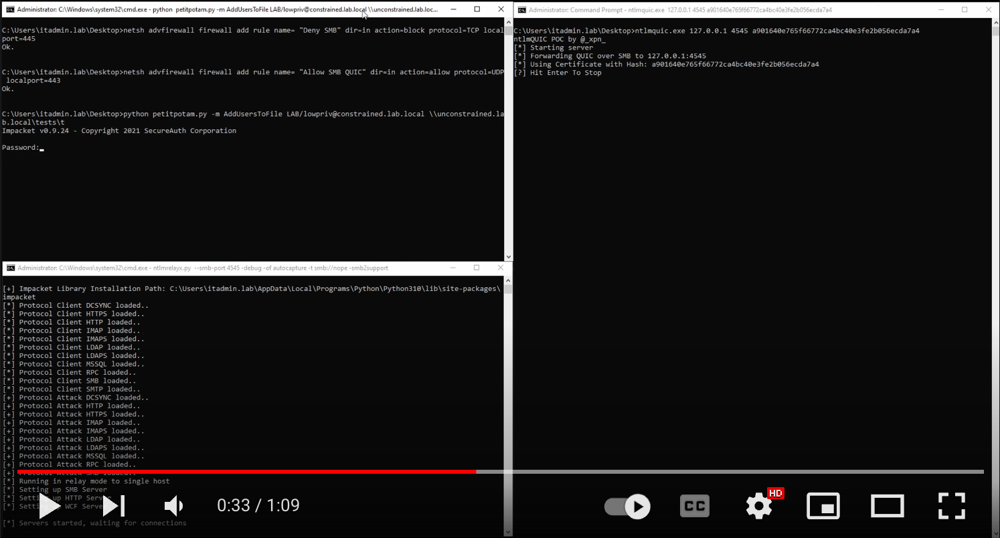

## NTLMquic POC Collection

This repo contains a collection of POC's to allow unwrapping the SMB over QUIC protocol. The purpose of this is to allow us to continue with tools like Responder and Impacket without having to directly add support for QUIC.

## Paths

* /ntlmquic - A C++ example using msquic to unwrap QUIC and proxy to SMB over TCP
* /ntlmquic-go - A go example of unwrapping QUIC and proxy to SMB over TCP

## Blog Post

[https://www.trustedsec.com/blog/making-smb-accessible-with-ntlmquic/](https://www.trustedsec.com/blog/making-smb-accessible-with-ntlmquic/)

## Examples

### NTLMquic using PetitPotam on Windows Host

